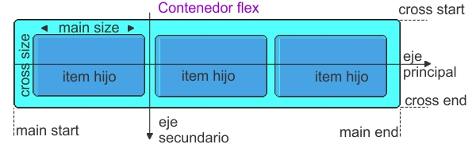

# Flexbox

Flexbox, a diferencia de CSS Grid, **no** es multidimensional. Sin embargo... **¿A qué se refiere esto?**

CSS Grid trabaja con filas y columnas sin problemas, en cambio Flexbox solo trabaja con un eje, o bien filas o bien columnas. Además, los elementos que estarán en el contenedor tendrán un tamaño independiente, o sea, si se eligió una propiedad, la otra no será proporcional necesariamente.

### Elementos de Flexbox:

***Figura 1:***

***Figura 2:***

*Página de referencia:*
***https://www.aluracursos.com/blog/flexbox-css-guia-completo-elementos-y-ejemplos***
